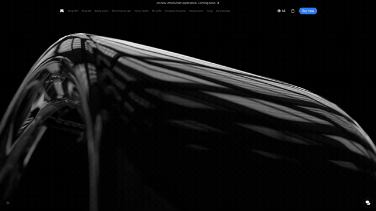

# srp

**Record a perfectly smooth, dead-linear scroll of any webpage to video.**

*screen record playwright*

---


**apple.com/ae/airpods-pro** · Six seconds held on the hero while its video plays at its own speed,
then the highlights carousel advanced one card mid-capture, then 27000px of scroll.
[The plan that made it](examples/airpods-pro.plan.cjs) · [full 51s recording](docs/airpods-pro.mp4)



**ultrahuman.com/ring** · A replay button clicked on frame 0, six seconds held while the hero video
plays through once, then 22000px of scroll.
[The plan that made it](examples/uh-ring.plan.cjs) · [full 36s recording](docs/uh-ring.mp4)

---

srp is not a screen recorder. It computes the exact scroll position for every output frame, advances
page time by exactly one frame, screenshots, and pipes the PNGs into a bundled ffmpeg at a locked
frame rate.

That buys three things a real-time recorder cannot give you:

|  |  |
|---|---|
| **No jitter, ever** | Scroll offset is a pure function of frame index, so the motion has no easing and no dropped frames by construction. |
| **Exact length** | A 20 second scroll is 20.000 seconds of video. A slow machine takes longer to render; it does not produce a worse file. |
| **Animation at true speed** | Page time is stepped one frame at a time, so a 7.5s video loop takes 7.5s of finished video no matter how long each frame took to capture. |

---

## Install

Needs **Node 20+**. ffmpeg ships bundled via `ffmpeg-static`, so there is nothing else to install.

```bash
cd srp
npm install          # playwright + ffmpeg-static, and downloads Chromium
npm link             # optional: puts `srp` on your PATH
```

`npm install` runs `playwright install chromium` for you. If it goes missing, run
`npx playwright install chromium`.

## Quick start

```bash
# a plain top-to-bottom scroll
srp https://site.com 20 --out demo.mp4

# hold 2s at 40%, and 1.5s on the pricing section
srp https://site.com 20 --pause 40%:2 --pause '#pricing:1.5'

# see the frame schedule without spending a render
srp https://site.com 20 --pause 40%:2 --dry-run

# no npm link? use the entry point directly
node bin/srp.js https://site.com 20
```

The video is written relative to your current directory. `--out clip.webm` switches to VP9.

---

## Pausing

Hold the scroll so an animation can play out. Targets are a percentage, a pixel offset, a CSS
selector, or `top` / `bottom`:

| Target | Means |
|---|---|
| `40%` | 40% of the scrollable extent |
| `1200px` or `1200` | absolute pixels |
| `top` / `bottom` | 0% / 100% |
| `#pricing` | scroll that element to the top of the viewport |
| `#hero@center` | centre it in the viewport instead |
| `#hero@+120` | 120px further down |
| `#hero@center-40` | both |

Modifiers live behind an `@`, so a selector that happens to end in a number is never misread:
`#hero-40` is the element, not `#hero` offset by 40.

**Pauses extend the video.** `srp site.com 10 --pause 40%:2 --pause bottom:1` is a 13 second clip:
`--duration` is the scroll-motion time and holds add on top. Pass `--fixed-duration` to make it a
hard 10 instead, compressing the scroll to make room.

Scroll time is shared between the legs in proportion to distance, so a pause at 90% correctly gets a
long first leg and a short last one rather than two equal halves:

```
$ srp https://site.com 10 --pause 50%:2 --dry-run
  extent 1760px · 12s total (10s scroll + 2s held) · 60fps · 720 frames
   0  scroll  0 -> 880px       5s      frames 0..299    (300)
   1  hold    hold @ 880px     2s      frames 300..419  (120)
   2  scroll  880 -> 1760px    5s      frames 420..719  (300)
```

---

## Running your own code

`--script` takes a file exporting `before` and `after`. They get Playwright's `page`, so they can do
anything Playwright can:

```js
// hooks.js
module.exports = {
  before: async (page) => page.click('#accept-cookies'),
  after:  async (page) => page.hover('.cta'),
};
```

```bash
srp https://site.com 10 --script ./hooks.js --pause 40%:2
```

`before` runs after load but **before** the settle wait, the warm-up pass and measurement, so
dismissing a modal or expanding an accordion reflows the page before any geometry is read.

For full control, `--plan` describes the whole timeline. Steps run in order, and any step can carry
an `action` that fires on one of its frames:

```js
// plan.js
module.exports = {
  url: 'https://site.com',
  out: 'demo.mp4',

  before: async (page) => page.click('#accept-cookies'),

  timeline: [
    { scrollTo: '#hero',    duration: 2 },
    { hold: 1.5, action: async (page) => page.click('.tab-2') },
    { scrollTo: '#pricing', duration: 3 },
    { hold: 1 },
    { scrollTo: '100%',     duration: 4 },
  ],

  after: async (page) => page.screenshot({ path: 'last.png' }),
};
```

```bash
srp --plan ./plan.js
```

Both CommonJS and ESM load, with a default export or named exports. A plan file can set any option
(kebab or camel case) except `help`, `version`, `plan` and `script`; a flag you actually type still
wins.

### Timeline steps

A step is either a scroll or a hold, never both. These are all the keys it takes:

| Key | On | Meaning |
|---|---|---|
| `scrollTo` | scroll | Where to scroll to. Required. Takes any target |
| `hold` | hold | How long to hold, in seconds. This *is* the length, so do not also pass `duration` |
| `at` | hold | Where to hold. Omit it to hold wherever the previous step ended, which is usual |
| `duration` | scroll | Seconds. Omit it to share the top-level budget with the other open-ended steps |
| `action` | either | `async (page, ctx) => {}`, fired on one frame of this step |
| `actionAt` | either | `'start'` (default) or `'end'`: the step's first or last frame |
| `label` | either | Shown in `--dry-run` and in log lines |

### The hook context

Hooks are called `fn(page, ctx)`. `page` is a real Playwright `Page`. `ctx` carries:

| Field | |
|---|---|
| `ctx.page` | The same `Page` |
| `ctx.viewport` | `{ width, height }` |
| `ctx.maxScroll` | Scrollable extent in px (still `0` during `before`) |
| `ctx.frame` | `undefined` in `before`/`after`; in an action, `{ index, total, tMs, y, progress }` |
| `ctx.clock.paused()` | Whether page time is currently frozen |
| `ctx.clock.nowMs()` | Page time for this frame, or `null` if not frozen |
| `ctx.sleep(ms)` | Advance page time. See below |
| `ctx.log(msg)` | Print a line under the current step's label |

> **Inside a hook, use `ctx.sleep(ms)`, not `page.waitForTimeout(ms)`.** During capture the page
> clock is frozen, so `waitForTimeout` burns real seconds while the page sits still, and an in-page
> `setTimeout` never fires at all. `ctx.sleep` advances page time instead, without spending video
> frames on it: to *watch* something play, give the step a longer `hold`.

A failing per-frame action warns and carries on, because losing a whole render to a decorative click
is worse than losing the click. `--strict-hooks` makes it abort instead. A failing `before`/`after`
always aborts, and the partial video is removed.

### Worked examples

Every file in [`examples/`](examples/) is loaded and validated by the test suite, so none of them can
drift out of sync with the validator. Copy one and cut it down. Your own files go in
[`hooks/`](hooks/), which is git-ignored so scratch work never shows up in `git status`.

| File | What it shows |
|---|---|
| [`basic.hooks.cjs`](examples/basic.hooks.cjs) | The smallest `--script` file |
| [`basic.hooks.mjs`](examples/basic.hooks.mjs) | The same thing as an ES module |
| [`basic.plan.cjs`](examples/basic.plan.cjs) | The smallest `--plan` file |
| [`reference.plan.cjs`](examples/reference.plan.cjs) | Every supported key, annotated |
| [`recipes.plan.cjs`](examples/recipes.plan.cjs) | The patterns worth copying, each with its reasoning |
| [`airpods-pro.plan.cjs`](examples/airpods-pro.plan.cjs) | The recording at the top of this page: hold on the hero, advance a carousel mid-capture, scroll 27000px |
| [`uh-ring.plan.cjs`](examples/uh-ring.plan.cjs) | Click a replay button on frame 0, hold 6s while the hero video plays at true speed, scroll 22000px |

---

## Deterministic time

Producing one frame costs far more real time than the `1/fps` it represents, so anything the page
animates by itself would run at the wrong speed. Three mechanisms stop that, all on by default:

| Mechanism | Covers |
|---|---|
| `page.clock` | Everything JavaScript-timed: `requestAnimationFrame`, `setTimeout`, `setInterval`, `Date.now`, `performance.now`. GSAP and friends land here |
| Web Animations API | CSS keyframe animations and transitions, which live on the compositor's own timeline and are untouched by the clock |
| Pause and seek | `<video>` and SVG SMIL, which run on the media pipeline and Blink's SMIL timer and are untouched by both of the above |

Two things are deliberately left alone. Scroll-driven CSS (`animation-timeline: scroll()`) is already
frame-locked by scroll position, and freezing it would kill the exact effect you are recording. A
video that is already **paused** when srp first sees it is either deliberately stopped or scrubbed by
scroll, which is how Apple's product pages drive their hero videos; only a video seen *playing* is
taken over.

Without the third mechanism a video plays at `(real ms per frame) / (1000/fps)` times speed. On the
recording above that was about 6x: a 7.5 second loop finished six times inside a six second hold.

By default anything already running when capture starts keeps its phase. `--restart-animations`
starts everything from zero on frame 0, so two runs put every animation at the same point on every
frame.

<details>
<summary><b>How reproducible is it, exactly?</b></summary>

<br>

Frame timing is exact: on any run, frame `i` is rendered at page time `i * 1000/fps`, to the
millisecond.

Pixels are byte-identical for content that is a pure function of scroll position. They are not
*quite* byte-identical for an element Chromium has promoted to its own compositor layer: whether it
is still on that layer at screenshot time is settled at page load, and the two paths rasterise edge
antialiasing a shade differently. That shows up as a thin halo worth a hundred-odd pixels, never as
a difference in animation phase.

</details>

<details>
<summary><b>What is still not frame-locked</b></summary>

<br>

- **`setInterval` with a period shorter than one frame.** The clock advances one frame at a time and
  fires each due timer once, so `setInterval(fn, 10)` at 60fps fires 60 times per second of page
  time rather than 100, about 0.6x speed. Periods at or above the frame step are exact, and
  `requestAnimationFrame` is unaffected.
- **Animated GIF, APNG and animated WebP**, advanced by Blink's image pipeline with no JavaScript
  hook to seek them.
- **`<marquee>`**, which has its own internal timer.
- A WAAPI animation paused past its end reports `playState: 'paused'`, so its `finished` promise
  never resolves. Pages that sequence with `el.animate(...).finished.then(next)` stall after the
  first step. rAF-driven libraries are unaffected.

</details>

If a page misbehaves with faked timers (a consent SDK that polls, a player that uses
`performance.now` for buffering), fall back with `--no-clock`. Everything else still works.

---

## Options

| Option | Default | Description |
|---|---|---|
| `url` *(positional)* / `--url` | `http://localhost:3000` | Page to record. A bare host like `localhost:5173` gets `http://`; a path like `./index.html` becomes a `file://` URL. |
| `duration` *(positional)* / `-d`, `--duration` | `10` | Scroll-motion seconds. Pauses add on top unless `--fixed-duration`. |
| `--fixed-duration` | *(off)* | Make `--duration` the hard total and compress the scroll to fit the pauses. |
| `--pause <target>:<sec>` | | Hold at a point. Repeatable. |
| `--plan <file>` | | A `.js` file exporting `{ timeline, before, after }`. |
| `--script <file>` | | A `.js` file exporting `{ before, after }`. |
| `--hook-timeout <sec>` | `15` | Give up on a hook that has not returned in this long. |
| `--strict-hooks` | *(off)* | Abort on a failing per-frame action instead of warning. |
| `-o`, `--out <file>` | `scroll.mp4` | Output file. `.mp4` gives H.264, `.webm` gives VP9. |
| `--fps <n>` | `60` | Output frame rate (locked). |
| `--width <px>` | `1920` | Viewport width (rounded to an even number). |
| `--height <px>` | `1080` | Viewport height (rounded to an even number). |
| `--wait <sec>` | `3` | Settle time after load, before capture. `0` is allowed. |
| `--no-warmup` | *(off)* | Skip the pre-scroll that loads lazy content. Faster, but can clip footers. |
| `--headed` | *(off)* | Show the browser window instead of running headless. |
| `--no-clock` | *(off)* | Record at wall-clock time instead of frame-locking page time. |
| `--css <waapi\|off>` | `waapi` | Frame-lock CSS keyframes and transitions too. |
| `--video <seek\|off>` | `seek` | Frame-lock `<video>` and SVG SMIL, which run on wall-clock otherwise. |
| `--restart-animations` | *(off)* | Start every animation, video and SMIL clip from 0 on frame 0. |
| `--shadow-animations` | *(off)* | Also freeze animations inside shadow roots (walks the DOM every frame). |
| `--dry-run` | *(off)* | Measure the page and print the frame schedule without recording. |
| `--dump-frames <dir>` | | Also write every frame as a PNG plus a `frames.json`, for debugging. |
| `-h`, `--help` | | Print the option list. |
| `--version` | | Print the version. |

---

## How a run goes

```
▶ Recording https://your-site.com
  1920x1080 · 60fps
  waiting 3s for the page to settle…
  warming up (loading lazy content so the footer is not clipped)…
  scroll extent: 12000px (page grew 600px during warm-up)
  12s · 720 frames (2s held)
  capturing frames…
  frame 720/720
✔ Saved /path/to/scroll.mp4
```

Load, `before` hook, settle, warm-up scroll, measure the stable height, resolve every selector, build
the frame schedule, freeze the clock, capture, `after` hook, encode.

**Capture is not real time.** A 51 second clip at 60fps is 3060 screenshots and takes minutes. That
is precisely why the motion is perfect, and why the output is always exactly the length you asked
for. Use `--dry-run` to check the plan before committing to a render.

## Notes and troubleshooting

- **Footer getting clipped?** Heavy pages lazy-load as you scroll, so they grow taller mid-scroll.
  The warm-up pass (on by default) scrolls through once to trigger it all *before* measuring. If a
  page is still growing afterwards the run says so; raise `--wait`.
- **Element positions are measured once,** after the `before` hook and warm-up. If a mid-capture
  action changes the layout, selector targets resolved later are stale. Put layout-changing work in
  `before`.
- **Don't navigate inside a per-frame action.** Each clock step registers an init script that a
  navigation would replay into the new document.
- **Output is exactly the viewport size.** `deviceScaleFactor` is `1`, so `1920x1080` in gives
  `1920x1080` out. Retina capture is not wired up yet.
- **MP4 vs WebM.** MP4/H.264 (`yuv420p`, `+faststart`) plays everywhere; WebM/VP9 is smaller. Pick
  with the `--out` extension.

## Development

```bash
npm test           # unit tests, no browser needed
npm run test:e2e   # records fixtures and checks the result
npm run test:all
```

Source layout, starting at `src/cli.js`. Flags and an optional plan file compile to one normalised
plan; the plan plus measured page geometry compile to an explicit list of frames; the recorder walks
that list.

| File | Responsibility |
|---|---|
| `src/options.js` | The one option-spec table. Defaults, parsing and help text are all derived from it |
| `src/targets.js` | Parsing scroll targets and pauses, and resolving them to pixels. Pure |
| `src/plan.js` | CLI flags plus a plan file, compiled into one normalised plan. Pure |
| `src/schedule.js` | A plan plus page geometry, turned into an explicit list of frames. Pure |
| `src/loader.js` | Loading a user's CJS or ESM plan/script file |
| `src/clock.js` | The deterministic clock, the frame stepper, and the paint barrier |
| `src/animations.js` | Freezing and seeking CSS animations through the Web Animations API |
| `src/videos.js` | Freezing and seeking `<video>` and SVG SMIL |
| `src/hooks.js` | Running user code safely: the ctx object, timeouts, error policy |
| `src/browser.js` | Everything that touches Playwright |
| `src/encoder.js` | ffmpeg |
| `src/recorder.js` | The frame loop |

`record-scroll.js` is kept as a back-compat entry point.

[`AGENTS.md`](AGENTS.md) is the playbook for coding agents: how to drive srp, and the invariants to
respect before changing `src/`. Several of them fail silently or hang rather than erroring, so it is
worth reading before touching the capture path.
